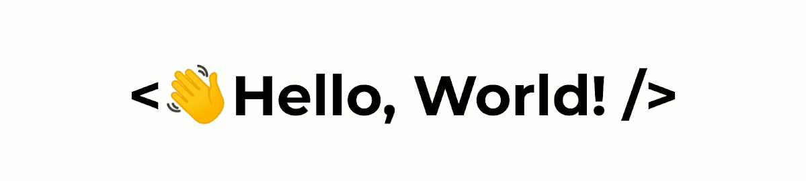

<div align="center">
    
</div>

### <h3> 👨‍🦱 &nbsp;Sobre mim </h3>

- 🤔 &nbsp; Explorando novas tecnologias e testando novas ideias.
- 🎓 &nbsp; Estudando **Análise e Desenvolvimento de Sistemas** no <a href="https://etep.edu.br/">Centro Universitário ETEP</a>.
- 📚 &nbsp; Aprendendo mais sobre **Programação**.

<br>

<div align="center">
  
</div>

<!-- <a href="https://github.com/anuraghazra/convoychat">
  
</a>  -->
<br/>

```JavaScript
function lucasCunegundes() {
 const nome = 'Lucas Cunegundes de Santana';
 const estudando = 'PROGRAMAÇÃO'
 let tecnologias = {
  Web: ["HTML", "CSS", "JavaScript"],
  BackEnd: ["JavaScript", "Python"],
  Bibliotecas: ["React", "Node"]  // Estudando atualmente
  }
}

```
<br/>

<a href="https://github.com/anuraghazra/github-readme-stats">
  
</a>
<a href="https://github.com/anuraghazra/github-readme-stats">
  
</a>

<br>
<h3 align="left">
📲 Contato
</h3>

[](https://www.linkedin.com/in/lucas-cunegundes/)
[](mailto:lucascsantana6@gmail.com)
<!-- [](https://www.instagram.com/cunegundez_/) -->


